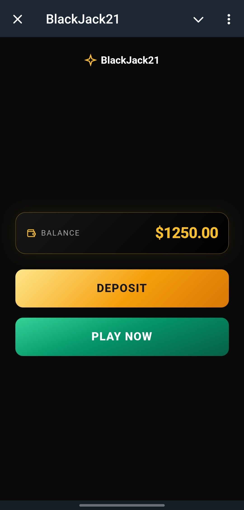
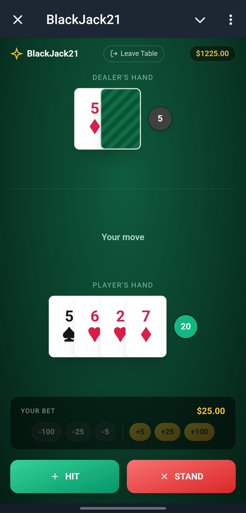
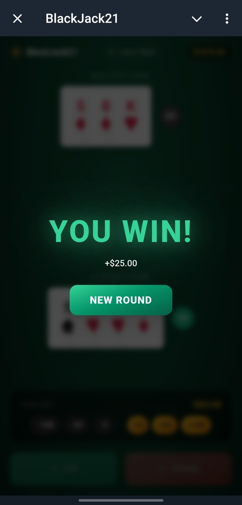

# Blackjack21 — Telegram Mini App

Full-stack Blackjack game built with **Go** and **Telegram Mini Apps**.


## About

Blackjack21 is a mobile-first Blackjack game designed for Telegram Mini Apps. The project includes a Go backend, REST API, Telegram authentication, and a responsive frontend optimized for Telegram mobile clients.

This project was created as a learning project to practice Go backend development, HTTP APIs, game state management, and Telegram Web Apps integration.

---

## Features

* Blackjack game engine
* Hit / Stand actions
* Dealer logic
* Blackjack and bust detection
* Game result calculation
* Balance and betting UI
* Telegram Mini App integration
* REST API backend
* Responsive dark-themed interface

---

## Tech Stack

**Backend**

* Go (`net/http`)
* JSON REST API

**Frontend**

* HTML
* CSS
* Vanilla JavaScript

**Telegram**

* Telegram Web Apps API
* `initData` authentication validation (HMAC-SHA256)

---

## Screenshots





---

## Project Structure

```text
blackjack21/
├── main.go
├── server.go
├── handlers.go
├── game.go
├── deck.go
├── card.go
├── player.go
├── score.go
├── telegram_auth.go
├── go.mod
├── web/
│   └── index.html
└── README.md
```

---

## API Endpoints

| Method | Endpoint            | Description            |
| ------ | ------------------- | ---------------------- |
| POST   | `/games`            | Start a new game       |
| POST   | `/games/{id}/hit`   | Take a card            |
| POST   | `/games/{id}/stand` | End player turn        |
| GET    | `/games/{id}`       | Get current game state |

---

## Telegram Authentication

The backend validates Telegram Mini App `initData` using the official Telegram algorithm:

* `X-Telegram-Init-Data` header
* HMAC-SHA256 signature verification
* TTL validation
* Telegram user extraction
* Development bypass mode for local testing

---

## Run Locally

### 1. Clone repository

```bash
git clone https://github.com/YOUR_USERNAME/blackjack21.git
cd blackjack21
```

### 2. Configure environment

Create `.env` (optional for local development):

```env
TELEGRAM_BOT_TOKEN=your_bot_token_here
TELEGRAM_AUTH_DISABLED=true
```

### 3. Start server

```bash
go run .
```

Open `http://localhost:8080`.

---

## Future Improvements

* PostgreSQL persistence
* Docker deployment
* Game history
* Leaderboard
* Daily rewards
* Split / Insurance logic
* Unit tests

---

## Author

**Artemy Panov**

GitHub: https://github.com/apanov-dev


